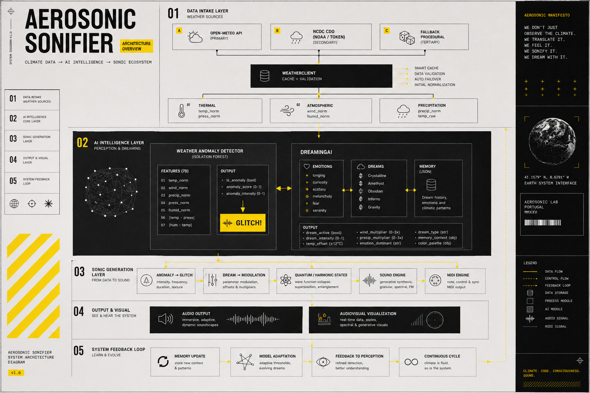

# AI as Catalyst | AEROSONIC SONIFIER  
## Unsupervised AI Weather Sonification System

[](https://www.fct.pt)
[]()
[](LICENSE)
[]()
[](https://www.inetmd.pt)
[]()
[](https://www.deepseek.com)
[](https://copilot.microsoft.com)
[]()

---

# 1. Purpose

The AEROSONIC Sonifier — AI Framework provides:

- a conceptual description of the AI layer  
- an overview of the agents composing the system  
- the data flow between meteorological input and musical output  
- the principles guiding state transitions and emergent behaviour  
- the scientific context of the CEEC‑FCT project *“AI as Catalyst”*  

This repository contains **documentation only**.  
No source code, model weights or internal algorithms are included.

---

# 2. AI Agents (Conceptual Overview)

- **Weather Agent** — interprets meteorological data  
- **Anomaly Detector** — identifies rare or unexpected states  
- **Dreaming AI** — generates imaginative variations  
- **Quantum State Agent** — manages stochastic transitions  
- **Harmonic Field Agent** — shapes harmonic behaviour  
- **Rhythm Engine** — produces temporal structures  
- **State Machine** — coordinates global system behaviour  

Full descriptions: `docs/agents.md`

---

# 3. Documentation Structure

```
docs/
│
├── overview.md
├── agents.md
├── architecture.md
├── data-flow.md
├── ai-models.md
├── conceptual-mapping.md
├── glossary.md
├── references.md
├── system-context.md
├── use-cases.md
├── methodology.md
└── system-diagram.md
```

---

# 4. Scientific Context

This framework is developed under the  
**FCT CEEC‑IND Grant 2024.09158.CEECIND — “AI as Catalyst”**,  
hosted at **INET‑md, University of Aveiro**.

The project investigates:

- AI as a catalyst for artistic creation  
- real‑time environmental sonification  
- emergent behaviour in computational musical systems  
- hybrid rule‑based, probabilistic and chaotic architectures  

---

# 5. Relationship to the AEROSONIC Ecosystem

The AEROSONIC Sonifier integrates with:

- real‑time meteorological data acquisition  
- anomaly detection (Isolation Forest)  
- heuristic emotional modelling (DreamingAI)  
- quantum‑inspired modulation  
- chaotic data mutation  
- generative musical processes  
- multi‑agent interaction  
- audiovisual rendering  

This documentation focuses on the **AI layer**.

---

> **AEROSONIC SONIFIER** is an unsupervised AI‑driven system that transforms meteorological and atmospheric data into real‑time musical behaviour.  
> It uses **Isolation Forest** for anomaly detection, multi‑agent interaction for emergent behaviour, and conceptual AI modelling to generate harmonic, rhythmic and structural transformations.

It is important to emphasise that the AEROSONIC Sonifier is **not** a system that generates random MIDI or control data.  
Instead, it operates as an **intelligent, multi‑agent behavioural ecosystem** in which musical decisions emerge from environmental interpretation, probabilistic reasoning and artificial intelligence.

## Architecture Overview

The following conceptual diagram illustrates the full architecture of the **AEROSONIC Sonifier** system, including data intake, AI intelligence, sonic generation, audiovisual output, and adaptive feedback loops.

<p align="center">
  
</p>

> *“We don’t just observe the climate.  
> We translate it.  
> We feel it.  
> We sonify it.  
> We dream with it.”*

---

# 6. Tools & AI Assistance

The development of the AEROSONIC Sonifier integrates advanced AI‑assisted research tools:

> **DeepSeek AI — Conceptual Modelling & Documentation Support**  
> https://www.deepseek.com/

> **Microsoft Copilot — Research Assistance & Structural Editing**  
> https://copilot.microsoft.com/

These tools support conceptual clarity, documentation refinement and interdisciplinary research workflows.

---

# 7. Collaborating Institutions

> **Hugo Paquete — Official Website**  
> https://hugopaquete.com/

> **Absonus Lab — Research & Artistic Laboratory (Portugal)**  
> https://absonuslab.org/

> **Planetário do Porto – Centro Ciência Viva**  
> https://www.planetarioporto.pt/

> **Ciencia Viva — National Agency for Scientific and Technological Culture**  
> https://www.cienciaviva.pt/

> **OTTOsonics (Austria)**  
> https://www.ottosonics.com/

Additional collaborators will be added as the project evolves.

---

# 8. What This Repository Contains

- conceptual descriptions of AI agents  
- high‑level architecture diagrams  
- data flow explanations  
- conceptual mapping strategies  
- glossary and references  
- academic framing  

---

# 9. What This Repository Does *Not* Contain

- source code  
- model architectures or parameters  
- training data  
- proprietary algorithms  
- implementation details  
- internal logic of the AEROSONIC engine  

---

# 10. Citation

**Paquete, H. (2026). _AEROSONIC Sonifier — AI Framework Documentation_. INET‑md / University of Aveiro.**

A BibTeX entry will be added once the Zenodo DOI is published.

---

# 11. License

**CC BY‑NC‑ND 4.0**  
Allows citation and academic reference; prohibits commercial use and derivative redistribution.

---

# 12. Intellectual Property Notice

This repository provides **conceptual and scientific documentation only**.  
All implementation details — including code, algorithms, model architectures, parameters, training data and internal logic — remain private and are not included here.
